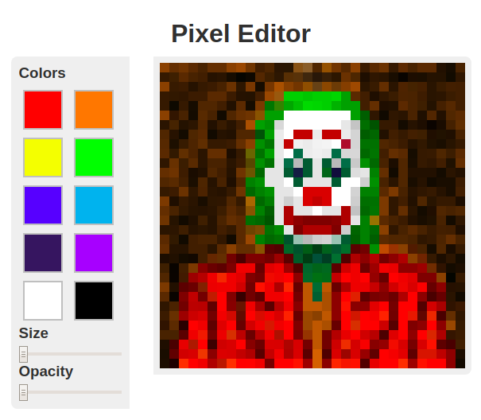

# Pixel Editor
Um editor de pixeis muito simple (_ainda em desenvolvimento_).

## Preview

Dá uma olhada [aqui](https://yudi-azvd.github.io/pixel-editor).

## A fazer
- Botão de salvar
- Botão de carregar
- Salvar desenho na memória quando a atualizar a página
- Refazer a UI
- Refatorar pra um código mais elegante
- outras funcionalidades básicas do MS Paint
